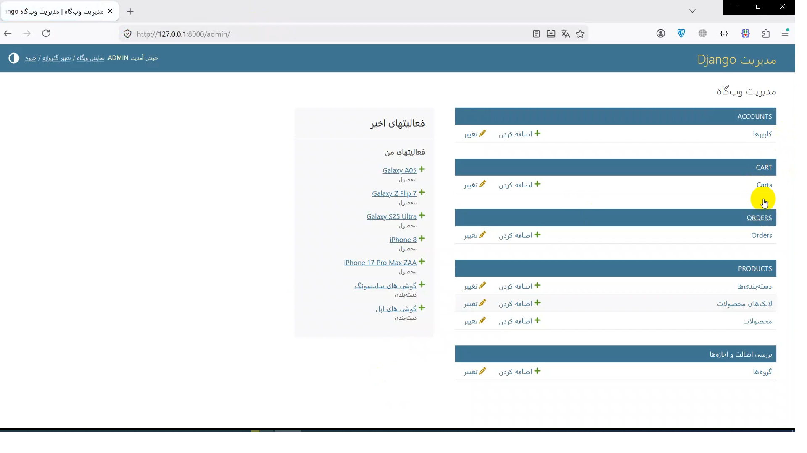
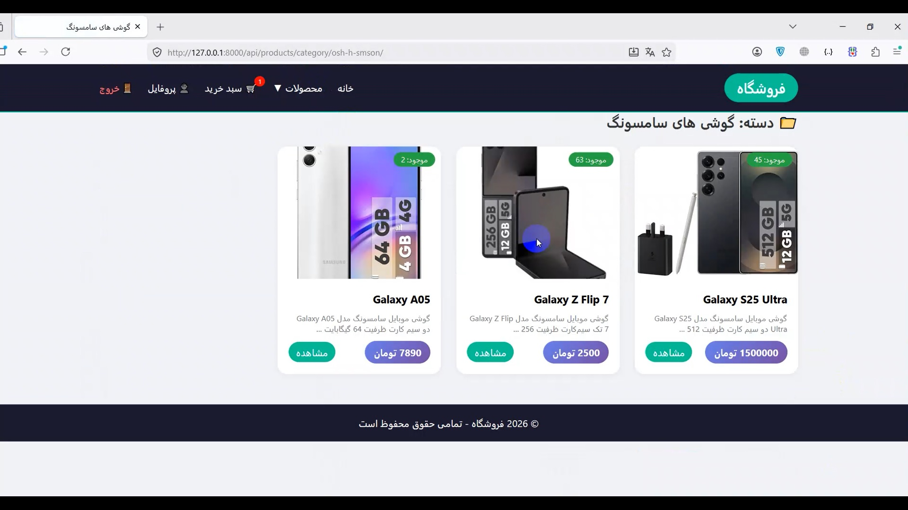
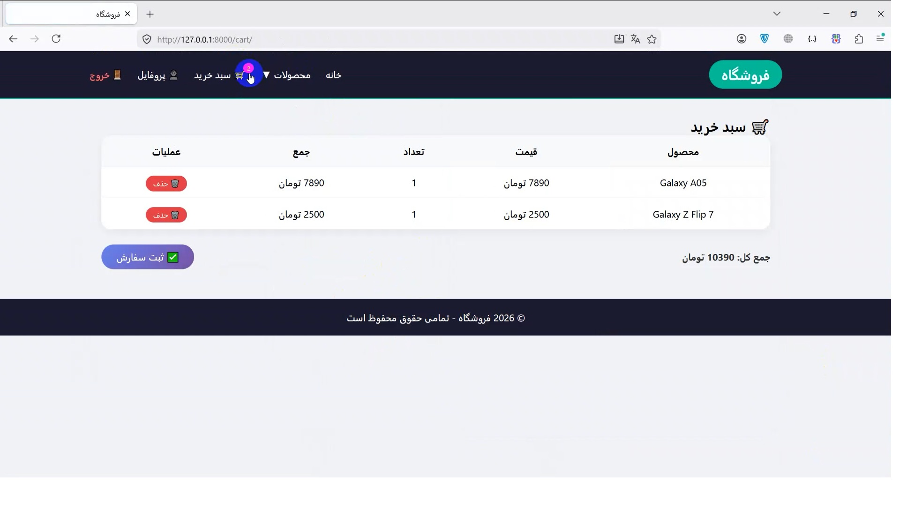
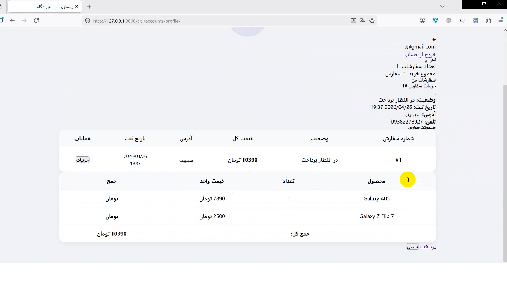
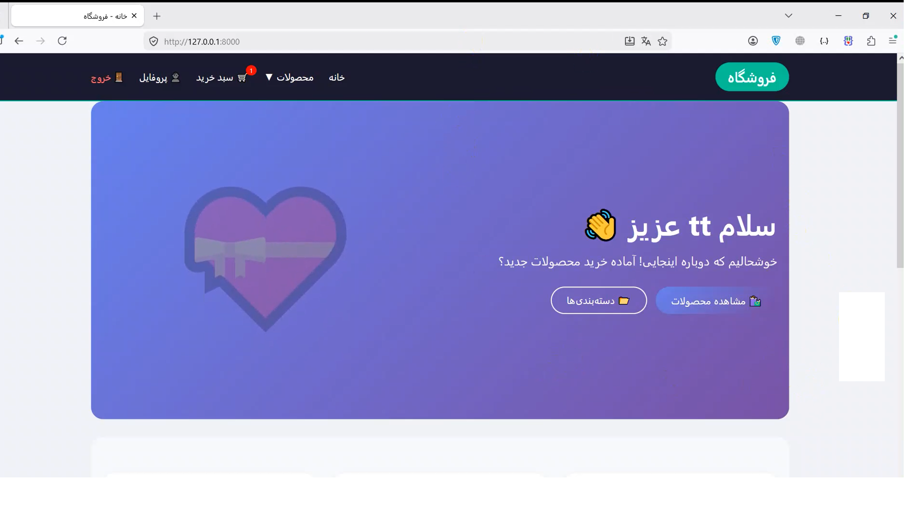

# 🛍️ Django Shop (RestShopEngine)

> فروشگاه اینترنتی با **Django + DRF + PostgreSQL** | مناسب برای توسعه و مقیاس‌پذیری

[](https://www.postgresql.org/)
[](https://www.django-rest-framework.org/)

---
## 🚀 امکانات

<div align="center">
  <table>
    <tr align="center">
      <td>
        
        <br />
        <strong>مدیریت محصول</strong><br />
        <sub>(پنل ادمین)</sub>
      </td>
      <td>
        
        <br />
        <strong>محصولات</strong><br />
        <sub>(دسته‌بندی)</sub>
      </td>
      <td>
        
        <br />
        <strong>سبد خرید</strong>
      </td>
      <td>
        
        <br />
        <strong>ثبت سفارش</strong>
      </td>
      <td>
        
        <br />
        <strong>صفحه اصلی</strong><br />
        
      </td>
    </table>
    <tr align="center">
      <td colspan="5">
        <strong>🔐 ثبت‌نام و احراز هویت + 💳 پرداخت شبیه‌سازی‌شده + ✨ API کامل با DRF</strong>
      </td>
    </tr>
  </table>
</div>

---

## 🛠️ تکنولوژی‌ها

`Django Rest Framework(DRF)` • `PostgreSQL` • `HTML/CSS/JS`

---

## ⚡ نصب سریع

```bash
git clone https://github.com/kobrafarshidi/RestShopEngine.git
cd RestShopEngine
python -m venv venv
source venv/bin/activate  # در ویندوز: venv\Scripts\activate
pip install -r requirements.txt
python manage.py migrate
python manage.py createsuperuser
python manage.py runserver
